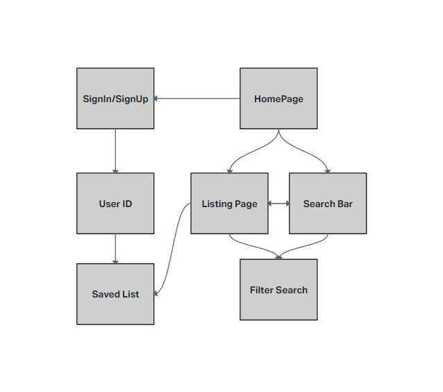
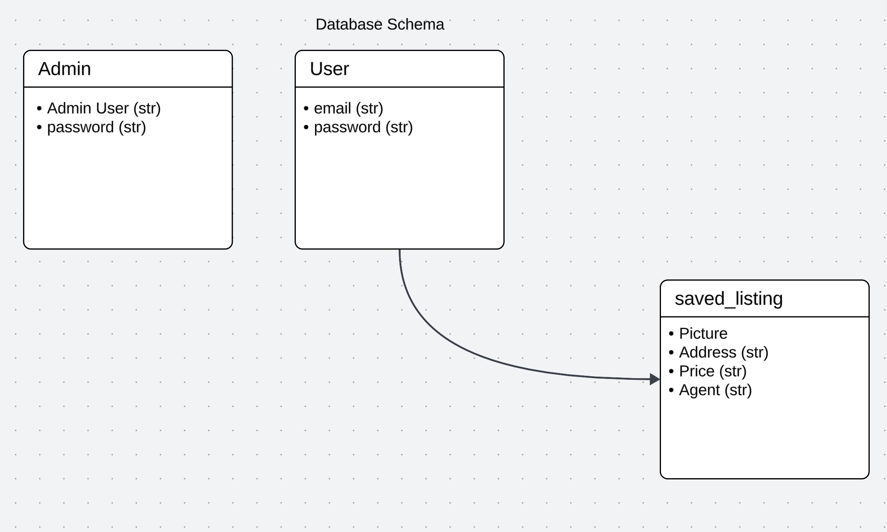
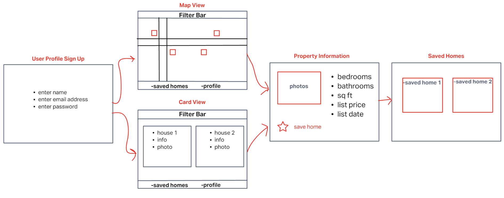

# Team Agreement

## Cooperation Plan

[Trello](https://trello.com/b/lx8kJkS4/final-project)

### What are the key strengths of each person on the team?

- Brendan
    - Jack of all trades
      
- DeAndre
    - Creativity and a willingness to explore new ideas, having fun.

- Zach
    - Good at project management, and tool use.
      
- Armando
    - Growth mindset, overcomes obstacles and solution oriented.
    - Adaptability and flexibility 

### How can you best utilize these strengths in the execution of your project?

- Brendan
    - By continuing to learn and trying things I might not be comfortable with

- DeAndre
    - Add different or new things to an already existing idea.

- Zach
    - Oversee all aspects of the project and ensure comradery.
  
- Armando
    - Being flexible with the team, time and task wise.

### In which professional competencies do you each want to develop greater strength?

- Brendan
    - writing
      
- DeAndre
    - Finding happiness.

- Zach
    - Getting better with the technical side of things.
      
- Armando
    - Gaining a better grasp of coding skills.
      

### Knowing that every person in your team needs to understand all aspects of the project, how do you plan to approach the day-to-day work?

Meet in remo every day and maintaining communication through slack.

## Conflict Plan

### What will be your group’s process to resolve conflict, when it arises?

- F.U.N. F is for friends who do things together, U is for you and me. N is for anywhere and anytime at all down here at Code Fellows.
    
### What will your team do if one person is taking over the project and not letting the other members contribute?

- We will communicate with the person what they are doing and talk it out. Take it to court.

### How will you approach each other and the challenges of the project knowing that it is impossible for all members to be at the exact same place in understanding and skill level?

- We will delegate tasks based off of people's strengths and weaknesses so that people will have equal time improving their skills in every area.

### How will you raise concerns to members who are not adequately contributing?

- We will communicate with the person what they are doing and talk it out. Take it to court. And utilize the project management app.

### How and when will you escalate the conflict if your resolution attempts are unsuccessful?

- Have an intervention. Involve the instructor.

## Communication Plan

### What hours will you be available to communicate?

 - Brendan: Whenever
- DeAndre: 12pm - 9pm est
- Zach: 11am - 8pm cst
- Armando: 9am - 9pm pst

### What platforms will you use to communicate (ie. Slack, phone …)?

- Slack
- Remo
- Trello
    
### How often will you take breaks?

- Once every 2 hours

### What is your plan if you start to fall behind?

- We will re-evaluate our MVP

### How will you communicate after hours and on the weekend?

- Slack
    
### What is your strategy for ensuring everyone’s voice is heard?

- Open door policy, maintaining respect, and democracy

### How will you ensure that you are creating a safe environment where everyone feels comfortable speaking up?

- We will maintain openness, respect for each other, and an open-door policy

## Work Plan

### How you will identify tasks, assign tasks, know when they are complete, and manage work in general?

- We will use a project management tool.

### What project management tool will be used?

- We will use Trello

## Git Process

### What components of your project will live on GitHub?

- All of them save for the database.

### How will you share the repository with your teammates?

- We will create an organization on GitHub

### What is your Git flow?
- We will have a dev fork that we will merge any off branches with and merge the dev fork back into main when everything is done.
- 

### Will you be using a PR review workflow? If so, consider:

- We will require two reviews and approvals from other teammates for a pull request.

### User Stories

1. Developer
   - As a developer, I want to create a real estate app that is easy to use and provides value to prospective home buyers.

2. Student
   - As a student, I want to utilize a real estate API and add more python skills to my repertoire.
  
3. Map View and Navigation
    - As a home searcher, I want to view search results on a map and easily navigate through different areas, so that I can visually assess property locations in relation to important landmarks or areas of interest.

4. Search Functionality
    - As a homebuyer, I want to be able to search for properties by location (city, ZIP code, neighborhood), so that I can find listings that are relevant to the area I'm interested in.
  
5. Gamer
   - As a sweaty gamer, I want to view the house results and prices, so that I can buy a house and follow my dream of being a professional Genshin Impact streamer.

  
### Vision

1. **What is the vision of this product?**

    - To give users another alternative to finding a house/property they wish to buy. 
    - Provide a ease of access user interface suitable for most users to help with the process of finding houses.

2. **What pain point does this project solve?**

    - Giving users an easier time in finding new homes, giving key information per estate and also limiting the amount of extra details that might not be relevant for users skimming through content.

3. **Why should we care about your product?**

    - This product hopes to streamline the process of searching for new homes by improving decision making, addressing a need for people who need to find a new home but also not get overwhelmed by the sheer number of information on properties that might not appeal to them.

### Scope (In/Out)

- **IN - What this product will do**
    - This web app will provide information about housing options based on the users preferences
    - This app will allow users to filter out content
    - This app will allow users to "star" their favorite estates and delete favorites
    - This app will allow stakeholders to be able to create clients and post them

- **OUT - What will your product not do**
    - Collect and distribute private information(Outside of name and email)
    - Provide direct selling services 
    - Money Laundering

### Minimum Viable Product (MVP) definition.

- real estate app that shows active listings in area
- Utilize API that fetches real-time real estate data from MLS
- Users can search on map, through zip code, or city
- Users can see listing data (price, address, description, etc.) of listings when they click on them
- Users can save favorite listings to create a list of their favorites

### Stretch goals

- Create chat for other users to chat with each other
- Create a mortgage estimator calculator

### Functional Requirements

  - User can create profile
  - User can search for active listings, and narrow search by utilizing filters
  - User can save their favorite listings

### Non-Functional Requirements

- Ensure the UI is easy to use and allows for seamless transition
- Make it accessible to users using screen readers
- Ensure that data is both accurate and clean

### Data Flow

# Wireframe

